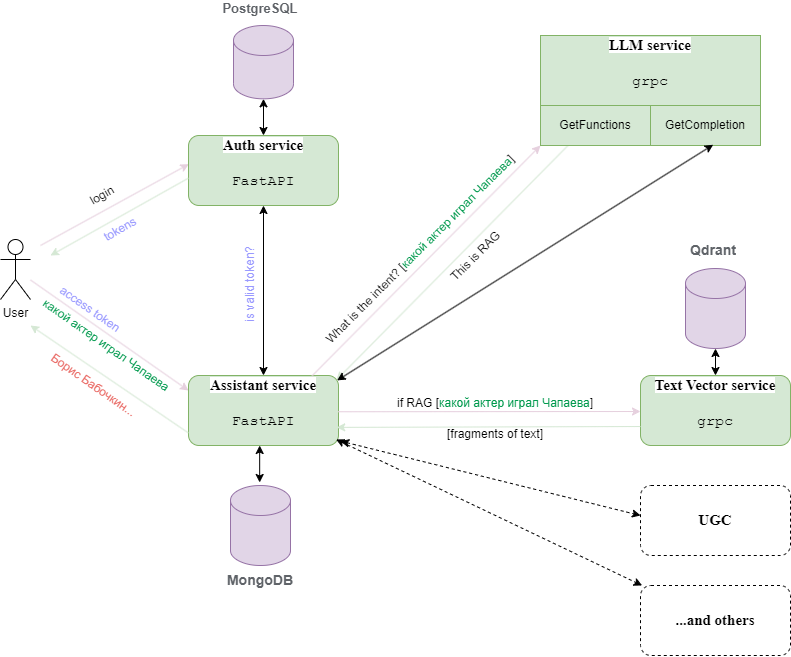

# «AI ассистент онлайн кинотеатра» 
__Дипломная работа на курсе Яндекс Практикум ["Расширенный курс мидл Python-разработчик" (11 месяцев)](https://practicum.yandex.ru/middle-python/)__

[_Ссылка на этот репозиторий_](https://github.com/Alexey77/graduate_work)

[](https://github.com/Alexey77/graduate_work/raw/main/cover.png)

## Общая схема

[](https://github.com/Alexey77/graduate_work/raw/main/cover.png)

## Сервисы созданные в рамках дипломного проекта

### [Auth service](https://github.com/Alexey77/graduate_work/tree/main/auth-service)

Сервис аутентификацией и авторизацией пользователей.

**Реализация**: FastAPI + JWT + Postgresql + SQLAlchemy + Alembic 

### [Assistant service](https://github.com/Alexey77/graduate_work/tree/main/assistant_service)

Сервис "AI-Ассистент" - единая точка входа для пользователей по всем вопросам онлайн кинотеатра.

**Реализация**: FastAPI + MongoDB + client gRPC

### [Text Vector Service](https://github.com/Alexey77/graduate_work/tree/main/text_vector_service)

GPRC сервис для преобразования текста в векторное представление и поиска по векторной базе данных

**Реализация**: server gRPC, Qdrant, TextEncoder

### [LLM Service](https://github.com/Alexey77/graduate_work/tree/main/llm_service)

GPRC сервис для взаимодействия с LLM

**Реализация**: server gRPC, aiohttp, (можно доделать до локальной LLM модели)

### [Wiki crawler](https://github.com/Alexey77/graduate_work/tree/main/wiki-scrapy-api-crawler)

Парсер API Wiki [eng](https://www.mediawiki.org/wiki/API) | [rus](https://www.mediawiki.org/wiki/API/ru)

**Реализация**: scrapy, SQLite, ETL из [SQLite в Qdrant](https://github.com/Alexey77/graduate_work/blob/main/text_vector_service/src/etl_wiki/run_etl_wiki.py), ETL из [Wikipedia dump в SQLite](https://github.com/Alexey77/graduate_work/blob/main/text_vector_service/src/etl_wiki/from_dump_to_sqlite.py)  

### Docker

Все сервисы завернуты в Docker


### Run project

1. Для запуска проекта в следующих директориях на основании `.env.example` файла нужно создать `.env` файл:

- assistant_service
- auth-service
- llm_service
- text_vector_service

2. Загрузить [dump Qdrant 0.9 Gb](https://storage.yandexcloud.net/yandex-practicum/docs-206350992826913-2024-11-17-17-31-15.7z), (не обязательно [dump SQlite 0.26 Gb](https://storage.yandexcloud.net/yandex-practicum/wiki_pages.7z)) 
3. Выполнить `docker-compose up -d --build`
4. Создать нового пользователя
   ```
   curl -L -X POST 'http://localhost:81/api/v1/auth/register' \
    -H 'Content-Type: application/json' \
    --data-raw '{
        "email": "test@example.com",
        "password": "1234qwerty",
        "first_name": "Test",
        "last_name": "User"
    }'
   ```
   
5. Получить `access_token`
    ```
    curl -L -X POST 'http://localhost:81/api/v1/auth/login' \
    -H 'Content-Type: application/json' \
    --data-raw '{
        "email": "test@example.com",
        "password": "1234qwerty"
    }'
    ```
6. Полученный токен использовать при запросе к ai-ассистенту
    ```
   curl -X 'POST' \
      'http://localhost/api/v1/assistant/chat' \
      -H 'accept: application/json' \
      -H 'Authorization: Bearer ••••••' \
      -H 'Content-Type: application/json' \
      -d '{
      "role": "user",
      "content": "Какие фильмы сняты по сказкам Пушкина?"
    }'
    ```

### Other

Реализован Github Actions для [линтера Ruff](https://github.com/Alexey77/graduate_work/blob/main/.github/workflows/lint.yml) и [pre-commit-config](https://github.com/Alexey77/graduate_work/blob/main/.pre-commit-config.yaml)  

### [Примеры ответов AI-Ассистента по RAG запросам](https://github.com/Alexey77/graduate_work/blob/main/docs/response.md)


### Участники команды:

* [Alexey77](https://github.com/Alexey77)
* [anjadvr](https://github.com/anjadvr)
* [itsuppartem](https://github.com/itsuppartem)